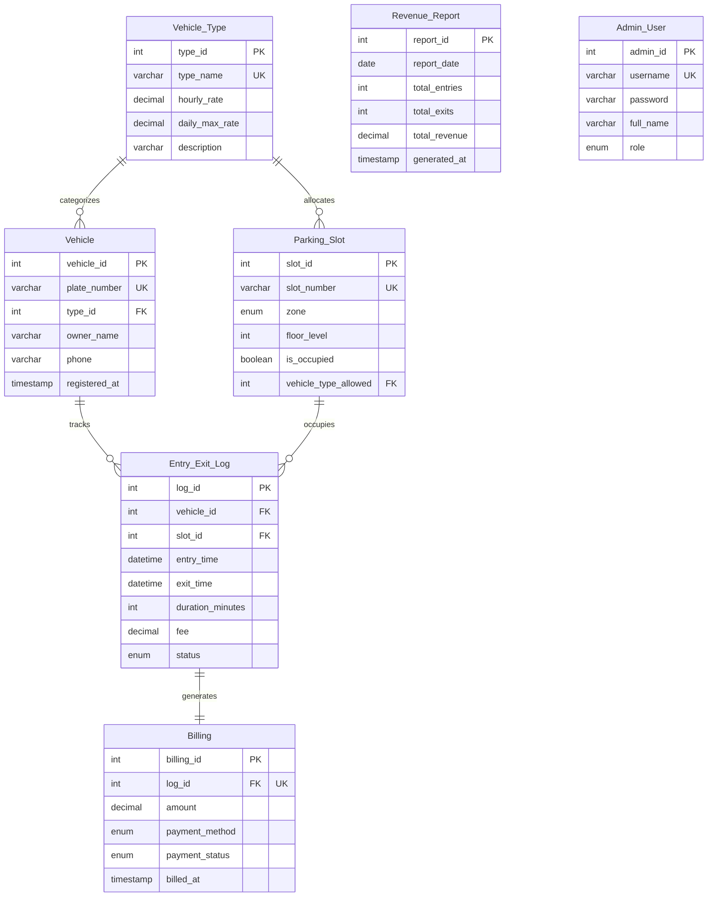

#  VEEB — Vehicle Entry-Exit & Billing Auditor
VEEB (Vehicle Entry-Exit & Billing Auditor) is a premium, lightweight web-based management system designed for parking slots, vehicle registrations, and automated billing. It features a modern dark-mode dashboard, dynamic slots visualization, detailed billing and reports, and an integrated interactive SQL terminal explorer.
The system relies heavily on **database-level automation** utilizing MySQL triggers to auto-calculate parking fees, manage slot occupancy, and aggregate revenue data in real-time.
---
##  Key Features
- **📊 Modern Analytics Dashboard**: Real-time stats cards tracking total vehicles, parked vehicles, slot availability, occupancy rates, and revenues (today vs. total). Includes a dynamic 7-day revenue bar chart.
- **🚗 Smart Entry/Exit Registry**:
  - **Auto-registration**: Enters unregistered vehicles as "Cars" automatically on entry.
  - **Automated Checkouts**: Simply select a parked vehicle plate, choose the payment method (Cash, UPI, or Card), and submit.
- **🚘 Vehicle Registry & Tiered Pricing**: Register vehicles and assign them to specific types (e.g. Two Wheeler, Car, SUV, Bus, Truck) each with distinct hourly rates and daily caps.
- **🅿️ Live Slot Occupancy Grid**: Color-coded parking bays (Green for free, Red for occupied) showing slot numbers, zones, floor levels, and allowed vehicle categories.
- **📈 Revenue Reports**: Daily automatic summaries of entries, exits, and earnings, plus a custom date-range query generator.
- **💻 Interactive SQL Terminal**: Run raw SQL queries against your database directly from the browser. Includes a **Quick Table Explorer** with clickable chips to inspect any table immediately.
---
## 🛠️ Tech Stack
- **Frontend**: Vanilla HTML5, CSS3 Custom Properties (variables, smooth transitions, responsive Grid & Flexbox), ES6 JavaScript Modules.
- **Backend**: Node.js, Express.js (REST APIs, static file delivery).
- **Database**: MySQL 8.x (triggers, relational integrity, auto-calculations).
---
## 📊 Database Architecture
The system database is governed by 7 main tables. Relational integrity is enforced using foreign keys with cascading deletions.
### Entity-Relationship Diagram

---
## ⚡ Database Automation (Triggers)
VEEB pushes business logic to the database level to ensure consistency and speed:
1. **`trg_on_entry` (AFTER INSERT ON `Entry_Exit_Log`)**  
   Automatically updates the target `Parking_Slot` status to `is_occupied = TRUE` as soon as a vehicle registers an entry.
   
2. **`trg_on_exit` (BEFORE UPDATE ON `Entry_Exit_Log`)**  
   Triggers when `exit_time` is recorded. It:
   - Calculates the total parked duration in minutes.
   - Finds the hourly rate and daily maximum rate for the vehicle type.
   - Computes the fee: `hourly_rate * hours` (rounded up, min 1 hour), capped at the type's `daily_max_rate`.
   - Frees up the associated `Parking_Slot` (`is_occupied = FALSE`).
   - Updates the log status to `'Exited'`.
3. **`trg_after_billing` (AFTER INSERT ON `Billing`)**  
   Maintains the `Revenue_Report` by incrementing the day's exit count and adding the payment amount to the day's `total_revenue`.
4. **`trg_count_entry` (AFTER INSERT ON `Entry_Exit_Log`)**  
   Increments the `total_entries` count for the current date in the daily `Revenue_Report` table.
---
## 🚀 Getting Started
### Prerequisites
- **Node.js** (v16 or higher)
- **MySQL Server** (v8.0 or higher)
### Step 1: Database Setup
1. Log into your MySQL server:
   ```bash
   mysql -u root -p
   ```
2. Import the schema, triggers, and seed data:
   ```sql
   SOURCE /path/to/veeb_database.sql;
   ```
   *(Or copy the contents of [veeb_database.sql](file:///d:/veeb/veeb_database.sql) and execute them in your database manager like phpMyAdmin, DBeaver, or MySQL Workbench)*
### Step 2: Backend Configuration
1. Navigate to the `backend` directory.
2. Create a `.env` file from the provided `.env.example` template:
   ```bash
   cp .env.example .env
   ```
3. Edit the `.env` file with your database credentials:
   ```ini
   DB_HOST=localhost
   DB_USER=your_mysql_username
   DB_PASSWORD=your_mysql_password
   DB_NAME=VEEB
   PORT=3003
   ```
### Step 3: Install Dependencies & Run
1. Install backend dependencies:
   ```bash
   npm install
   ```
2. Start the server:
   - For production:
     ```bash
     npm start
     ```
   - For development (hot-reload):
     ```bash
     npm run dev
     ```
3. Open your browser and visit:  
   👉 **`http://localhost:3003`**
---
## 📡 API Endpoints
The backend serves the static files for the frontend dashboard and exposes the following API routes:
|
 Method 
|
 Endpoint 
|
 Description 
|
 Request Body 
|
|
:---
|
:---
|
:---
|
:---
|
|
`GET`
|
`/api/dashboard`
|
 Fetches real-time statistics (totals, occupancy, today's/total revenue). 
|
 None 
|
|
`POST`
|
`/api/schema/query`
|
 Runs custom SQL query on the database. 
|
`{ "query": "SELECT * FROM Vehicle" }`
|
---
## 🎨 UI Design Tokens
The frontend features a sleek glassmorphic dark UI centered around:
- **Primary Color**: `#6C5CE7` (Royal Purple)
- **Accent Colors**: `#00CEC9` (Teal), `#FDCB6E` (Gold/Warning)
- **Backgrounds**: Slate Dark `#0F0E17` & Navy Card `#1E1E3A`
- **Typography**: `Outfit` for headers/scores, `Inter` for tables/content.
- **Responsiveness**: Native grid structures collapsing gracefully on mobile devices.
